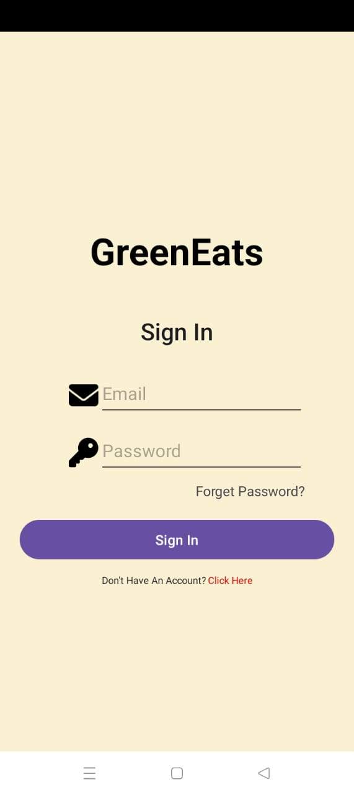
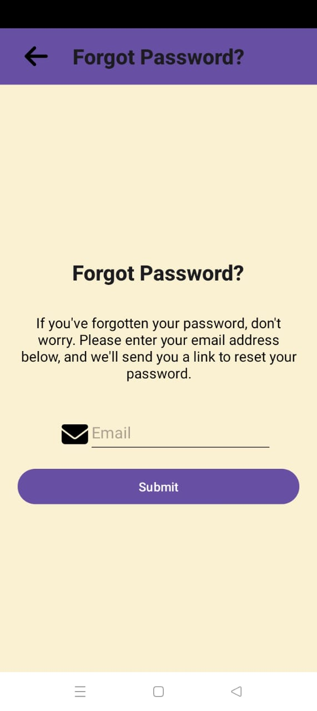
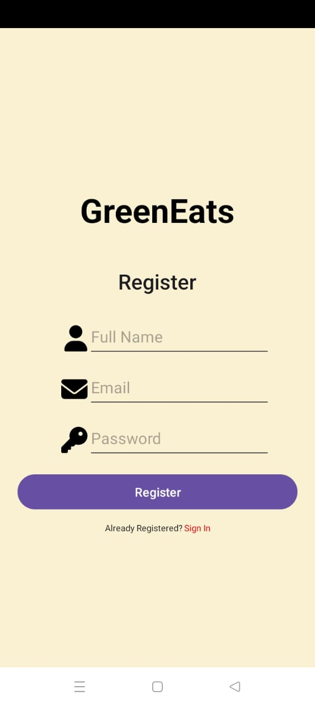
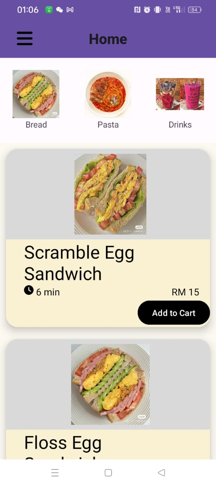
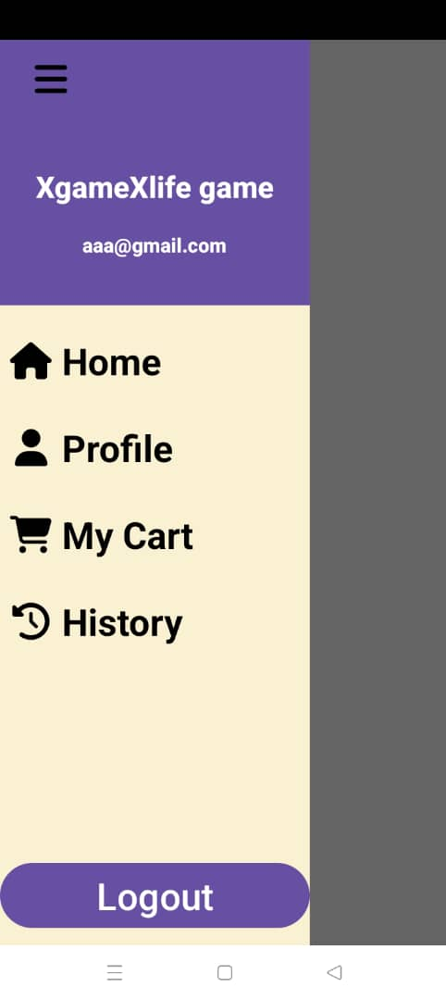
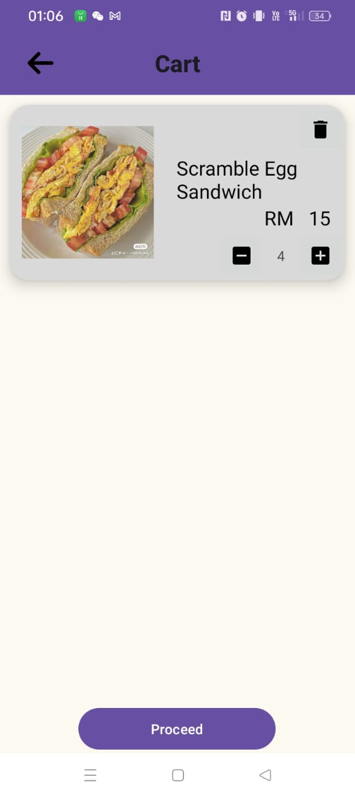
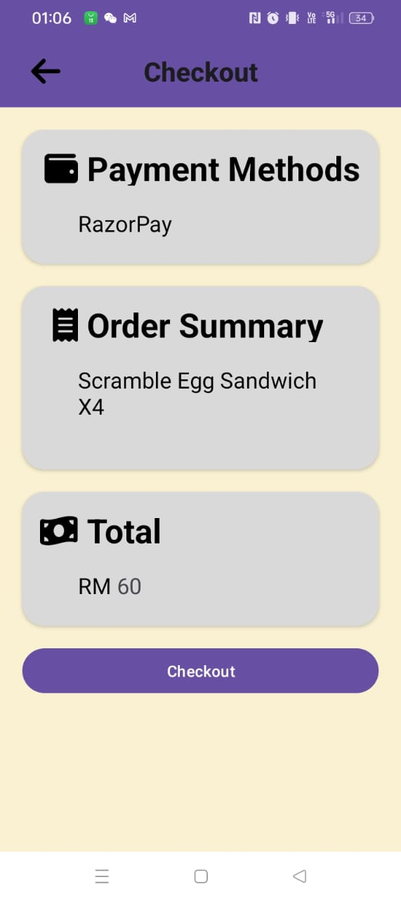
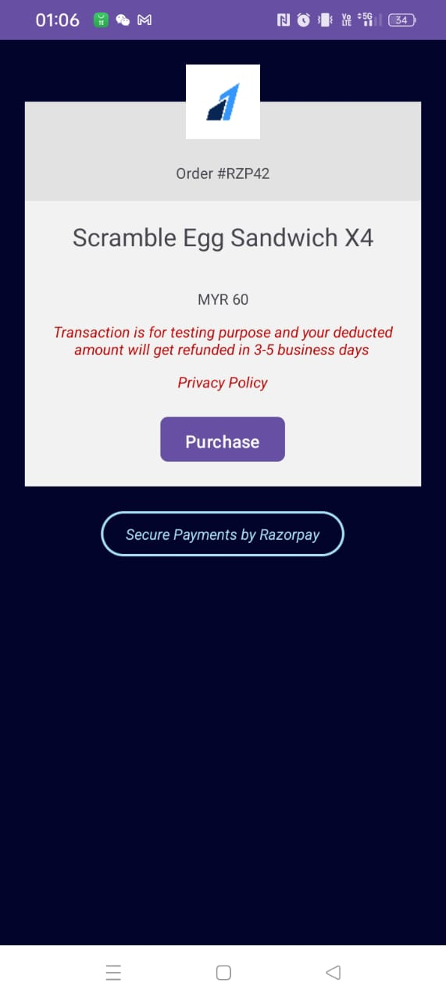
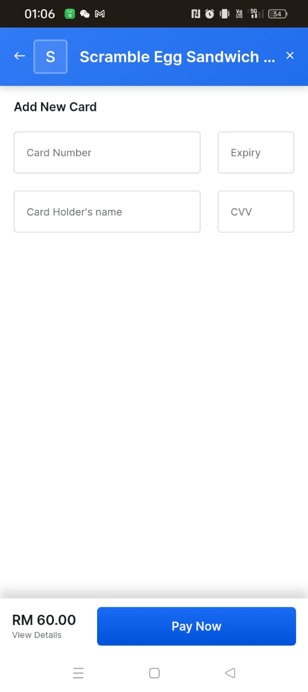

# Healthy Food E-Commerce Application

## Introduction:
In response to the increasing demand for convenient access to wholesome and nutritious food products, this project proposes the development of a mobile-based healthy food e-commerce application. The application aims to provide users with a seamless platform to discover, purchase, and consume healthy food alternatives, thereby promoting wellness and nutrition awareness.

## Programming Language and Technologies Used:

Android Studio: Kotlin will be used as the primary programming language for Android app development.
API Integration: The application will integrate with RazorPay API for payment processing and Firebase for user management and real-time data synchronization.
## Functionality:

1. User Management:
    - User registration and authentication.
    - User profiles and preferences management.

2. Order Processing:

    - Browse and search for restaurants and menu items.
    - Select items, customize orders, and add them to the cart.
    - Checkout and payment processing using RazorPay.
    - Real-time order tracking.

3. Search and Recommendation:
    - Search functionality for finding specific meals or restaurants.
    - Recommendation algorithms for suggesting personalized meal options based on user preferences and past orders.

4. Payment Processing:
    - Integration with RazorPay for secure payment processing.
    - Handling payments, refunds, and disputes.

